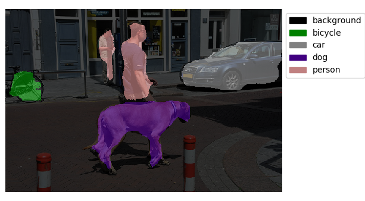

# coral_usb_ros
[](https://badge.fury.io/gh/knorth55%2Fcoral_usb_ros)
[](https://travis-ci.com/knorth55/coral_usb_ros)
[](https://hub.docker.com/r/knorth55/coral_usb_ros)
[](https://hub.docker.com/r/knorth55/coral_usb_ros)
[](https://hub.docker.com/r/knorth55/coral_usb_ros)
[](https://hub.docker.com/r/knorth55/coral_usb_ros)

ROS package for Coral Edge TPU USB Accelerator

## Environment

- Ubuntu 16.04 + Kinetic
- Ubuntu 18.04 + Melodic

If you want to run this on Ubuntu 14.04 + Indigo, please see [indigo branch](https://github.com/knorth55/coral_usb_ros/tree/indigo).

If you want to run this on PR2, please see [pr2 branch](https://github.com/knorth55/coral_usb_ros/tree/pr2).

## Notice

We need `python3.5` or `python3.6` to run this package.

## ROS node list

### Object detector: `edgetpu_object_detector.py`


For more information, please see [here](https://github.com/knorth55/coral_usb_ros#object-detector-edgetpu_object_detectorpy).

### Face detector: `edgetpu_face_detector.py`


For more information, please see [here](https://github.com/knorth55/coral_usb_ros#face-detector-edgetpu_face_detectorpy).

### Human pose estimator: `edgetpu_human_pose_estimator.py`


For more information, please see [here](https://github.com/knorth55/coral_usb_ros#human-pose-estimator-edgetpu_human_pose_estimatorpy).

### Semantic segmenter: `edgetpu_semantic_segmenter.py`



For more information, please see [here](https://github.com/knorth55/coral_usb_ros#semantic-segmenter-edgetpu_semantic_segmenterpy).

## Setup

### Install python3.5

```bash
sudo apt-get update
sudo apt-get install python3.5-dev
```

### Install Edge TPU Dependencies

```bash
cd ~/Downloads
wget https://dl.google.com/coral/edgetpu_api/edgetpu_api_latest.tar.gz -O edgetpu_api.tar.gz --trust-server-names
tar xzf edgetpu_api.tar.gz
cd edgetpu_api
bash ./install.sh
```

### Install Dependencies for indigo

```bash
sudo python3.5 -m pip install numpy==1.12.1
sudo python3.5 -m pip install Pillow==4.0.0
sudo python3.5 -m pip install ensurepip-vanilla
sudo apt-get install cmake3 python3.4-venv

```

### Add user in `plugdev`

```bash
sudo adduser -a -G plugdev username
```

### Workspace build

```bash
mkdir ~/ros/coral_ws/src
cd ~/ros/coral_ws/src
git clone https://github.com/knorth55/coral_usb_ros.git
wstool init
wstool merge coral_usb_ros/fc.rosinstall.indigo
wstool update
rosdep install --from-paths . --ignore-src -y -r
cd ~/coral_ws
catkin init
catkin config -DPYTHON_EXECUTABLE=/usr/bin/python3 -DPYTHON_INCLUDE_DIR=/usr/include/python3.4m -DPYTHON_LIBRARY=/usr/lib/x86_64-linux-gnu/libpython3.4m.so
catkin build
```

### Model download

```bash
source ~/coral_ws/devel/setup.bash
roscd coral_usb/scripts
rosrun coral_usb download_models.py
```

### Model training with your dataset

Please see [here](./training/README.md) for more detailed information.


## Demo 

### Run `image_publisher`

```bash
# source normal workspace, not edge tpu workspace
# /opt/ros/kinetic/setup.bash or /opt/ros/melodic/setup.bash
source /opt/ros/kinetic/setup.bash
rosrun jsk_perception image_publisher.py _file_name:=$(rospack find jsk_perception)/sample/object_detection_example_1.jpg
```

### Run Edge TPU launch

```bash
# source edge tpu workspace
source /opt/ros/${ROS_DISTRO}/setup.bash # THIS IS VERY IMPORTANT FOR MELODIC to set /opt/ros/${ROS_DISTRO}/lib/python2.7/dist-packages in $PYTHONPATH
source ~/coral_ws/devel/setup.bash       # THIS PUT devel/lib/python3/dist-packages in fornt of /opt/ros/${ROS_DISTRO}/lib/python2.7/dist-package
# object detector
roslaunch coral_usb edgetpu_object_detector.launch INPUT_IMAGE:=/image_publisher/output
# face detector
roslaunch coral_usb edgetpu_face_detector.launch INPUT_IMAGE:=/image_publisher/output
# human pose estimator
roslaunch coral_usb edgetpu_human_pose_estimator.launch INPUT_IMAGE:=/image_publisher/output
# semantic segmenter
roslaunch coral_usb edgetpu_semantic_segmenter.launch INPUT_IMAGE:=/image_publisher/output
```

### Run `image_view`

```bash
# source normal workspace, not edge tpu workspace
# /opt/ros/kinetic/setup.bash or /opt/ros/melodic/setup.bash
source /opt/ros/kinetic/setup.bash
# object detector
rosrun image_view image_view image:=/edgetpu_object_detector/output/image
# face detector
rosrun image_view image_view image:=/edgetpu_face_detector/output/image
# human pose estimator
rosrun image_view image_view image:=/edgetpu_human_pose_estimator/output/image
# semantic segmenter
rosrun image_view image_view image:=/edgetpu_semantic_segmenter/output/image
```

## ROS node information

### Object detector: `edgetpu_object_detector.py`


#### Subscribing Topic

- `~input/image` (`sensor_msgs/Image`)

  - Input image

#### Publishing Topic

- `~output/rects` (`jsk_recognition_msgs/RectArray`)

  - Rectangles of detected objects

- `~output/class` (`jsk_recognition_msgs/ClassificationResult`)

  - Classification results of detected objects

- `~output/image` (`sensor_msgs/Image`)

  - Visualization of detection results

#### Parameters

- `~classifier_name` (`String`, default: `rospy.get_name()`)

  - Classifier name

- `~model_file` (`String`, default: `$(rospack find coral_usb)/models/mobilenet_ssd_v2_coco_quant_postprocess_edgetpu.tflite`)

  - Model file path

- `~label_file` (`String`, default: `$(rospack find coral_usb)/models/coco_labels.txt`)

  - Label file path.

#### Dynamic parameters

- `~score_thresh`: (`Float`, default: `0.6`)

  - Score threshold for object detection

- `~top_k`: (`Int`, default: `100`)

  - Maximum number of detected objects


### Face detector: `edgetpu_face_detector.py`


#### Subscribing Topic

- `~input/image` (`sensor_msgs/Image`)

  - Input image

#### Publishing Topic

- `~output/rects` (`jsk_recognition_msgs/RectArray`)

  - Rectangles of detected faces

- `~output/class` (`jsk_recognition_msgs/ClassificationResult`)

  - Classification results of detected faces

- `~output/image` (`sensor_msgs/Image`)

  - Visualization of detection results

#### Parameters

- `~classifier_name` (`String`, default: `rospy.get_name()`)

  - Classifier name

- `~model_file` (`String`, default: `$(rospack find coral_usb)/models/mobilenet_ssd_v2_face_quant_postprocess_edgetpu.tflite`)

  - Model file path

#### Dynamic parameters

- `~score_thresh`: (`Float`, default: `0.6`)

  - Score threshold for face detection

- `~top_k`: (`Int`, default: `100`)

  - Maximum number of detected faces


### Human pose estimator: `edgetpu_human_pose_estimator.py`


#### Subscribing Topic

- `~input/image` (`sensor_msgs/Image`)

  - Input image

#### Publishing Topic

- `~output/poses` (`jsk_recognition_msgs/PeoplePoseArray`)

  - Estimated human poses

- `~output/image` (`sensor_msgs/Image`)

  - Visualization of estimation results

#### Parameters

- `~classifier_name` (`String`, default: `rospy.get_name()`)

  - Classifier name

- `~model_file` (`String`, default: `$(rospack find coral_usb)/python/coral_usb/posenet/models/posenet_mobilenet_v1_075_481_641_quant_decoder_edgetpu.tflite`)

  - Model file path

#### Dynamic parameters

- `~score_thresh`: (`Float`, default: `0.2`)

  - Score threshold for human pose estimation

- `~joint_score_thresh`: (`Float`, default: `0.2`)

  - Score threshold of each joint for human pose estimation


### Semantic segmenter


#### Subscribing Topic

- `~input/image` (`sensor_msgs/Image`)

  - Input image

#### Publishing Topic

- `~output/label` (`sensor_msgs/Image`)

  - Estimated label image

- `~output/image` (`sensor_msgs/Image`)

  - Visualization of estimation results

#### Parameters

- `~classifier_name` (`String`, default: `rospy.get_name()`)

  - Classifier name

- `~model_file` (`String`, default: `$(rospack find coral_usb)/models/deeplabv3_mnv2_pascal_quant_edgetpu.tflite`)

  - Model file path

- `~label_file` (`String`, default: `None`)

  - Label file path. `pascal_voc` label is used by default.
