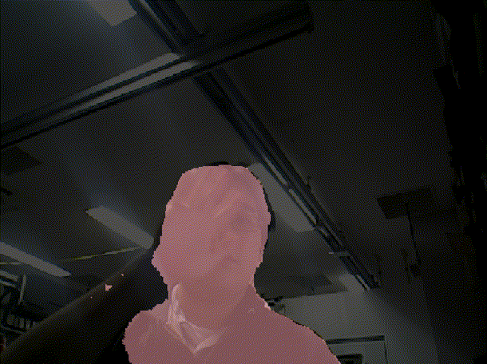
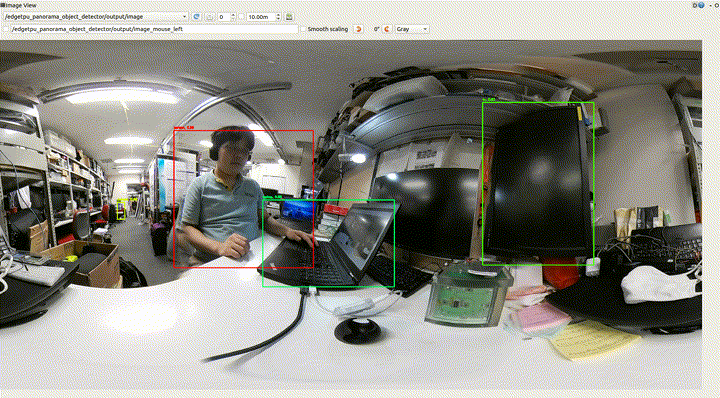
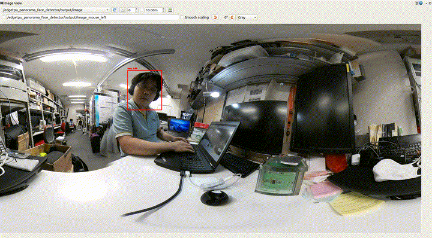

# coral_usb_ros

[](https://github.com/knorth55/coral_usb_ros/actions)

[](https://hub.docker.com/r/knorth55/coral_usb_ros)
[](https://hub.docker.com/r/knorth55/coral_usb_ros)
[](https://hub.docker.com/r/knorth55/coral_usb_ros)
[](https://hub.docker.com/r/knorth55/coral_usb_ros)

ROS package for Coral Edge TPU USB Accelerator

## Environment

- Ubuntu 16.04 + Kinetic
- Ubuntu 18.04 + Melodic

If you want to run this on Ubuntu 14.04 + Indigo, please see [indigo branch](https://github.com/knorth55/coral_usb_ros/tree/indigo).

If you want to run this on PR2, please see [pr2 branch](https://github.com/knorth55/coral_usb_ros/tree/pr2).

## Notice

We need `python3.5` or `python3.6` to run this package.

## ROS node list

### Object detector: `edgetpu_object_detector.py`


For more information, please see [here](https://github.com/knorth55/coral_usb_ros#object-detector-edgetpu_object_detectorpy-1).

### Face detector: `edgetpu_face_detector.py`


For more information, please see [here](https://github.com/knorth55/coral_usb_ros#face-detector-edgetpu_face_detectorpy-1).

### Human pose estimator: `edgetpu_human_pose_estimator.py`


For more information, please see [here](https://github.com/knorth55/coral_usb_ros#human-pose-estimator-edgetpu_human_pose_estimatorpy-1).

### Semantic segmenter: `edgetpu_semantic_segmenter.py`



For more information, please see [here](https://github.com/knorth55/coral_usb_ros#semantic-segmenter-edgetpu_semantic_segmenterpy-1).

### Panorama object detector: `edgetpu_panorama_object_detector.py`



For more information, please see [here](https://github.com/knorth55/coral_usb_ros#panorama-object-detector-edgetpu_panorama_object_detectorpy-1).

### Panorama face detector: `edgetpu_panorama_face_detector.py`



For more information, please see [here](https://github.com/knorth55/coral_usb_ros#panorama-face-detector-edgetpu_panorama_face_detectorpy-1).

### Panorama human pose estimator: `edgetpu_panorama_human_pose_estimator.py`


For more information, please see [here](https://github.com/knorth55/coral_usb_ros#panorama-human-pose-estimator-edgetpu_panorama_human_pose_estimatorpy-1).

### Panorama semantic segmenter: `edgetpu_panorama_semantic_segmenter.py`

For more information, please see [here](https://github.com/knorth55/coral_usb_ros#panorama-semantic-segmenter-edgetpu_panorama_semantic_segmenterpy-1).

### Node manager: `edgetpu_node_manager.py`

For more information, please see [here](https://github.com/knorth55/coral_usb_ros#node-manager-edgetpu_node_managerpy-1).

## Setup

### Edge TPU dependencies installation

#### [Install the Edge TPU runtime](https://coral.withgoogle.com/docs/accelerator/get-started/#1-install-the-edge-tpu-runtime)

```bash
echo "deb https://packages.cloud.google.com/apt coral-edgetpu-stable main" | sudo tee /etc/apt/sources.list.d/coral-edgetpu.list
curl https://packages.cloud.google.com/apt/doc/apt-key.gpg | sudo apt-key add -
sudo apt-get update
# If you do not have USB3, install libedgetpu1-legacy-std
sudo apt-get install libedgetpu1-legacy-max
sudo apt-get install python3-edgetpu
```

#### [Install just the TensorFlow Lite interpreter (Kinetic)](https://www.tensorflow.org/lite/guide/python)

```bash
sudo apt-get install python3-pip
wget https://dl.google.com/coral/python/tflite_runtime-1.14.0-cp35-cp35m-linux_x86_64.whl
pip3 install tflite_runtime-1.14.0-cp35-cp35m-linux_x86_64.whl
```

#### [Install just the TensorFlow Lite interpreter (Melodic)](https://www.tensorflow.org/lite/guide/python)

```bash
sudo apt-get install python3-pip
wget https://dl.google.com/coral/python/tflite_runtime-1.14.0-cp36-cp36m-linux_x86_64.whl
pip3 install tflite_runtime-1.14.0-cp36-cp36m-linux_x86_64.whl
```

For more information, please see [here](https://coral.withgoogle.com/docs/accelerator/get-started/).

### Workspace build

#### Workspace build (Kinetic)

```bash
sudo apt-get install python3-catkin-pkg-modules python3-rospkg-modules python3-venv python3-empy
sudo apt-get install ros-kinetic-opencv3
sudo apt-get install ros-kinetic-catkin
pip3 install --user opencv-python==4.2.0.32 numpy\<1.19.0
source /opt/ros/kinetic/setup.bash
mkdir -p ~/coral_ws/src
cd ~/coral_ws/src
git clone https://github.com/knorth55/coral_usb_ros.git
wstool init
wstool merge coral_usb_ros/fc.rosinstall
wstool merge coral_usb_ros/fc.rosinstall.kinetic
wstool update
rosdep install --from-paths . --ignore-src -y -r
cd ~/coral_ws
catkin init
catkin config -DPYTHON_EXECUTABLE=/usr/bin/python3 -DPYTHON_INCLUDE_DIR=/usr/include/python3.5m -DPYTHON_LIBRARY=/usr/lib/x86_64-linux-gnu/libpython3.5m.so
catkin build
```

#### Workspace build (Melodic)

```bash
sudo apt-get install python3-catkin-pkg-modules python3-rospkg-modules python3-venv python3-empy
sudo apt-get install python3-opencv
sudo apt-get install ros-melodic-catkin
source /opt/ros/melodic/setup.bash
mkdir -p ~/coral_ws/src
cd ~/coral_ws/src
git clone https://github.com/knorth55/coral_usb_ros.git
wstool init
wstool merge coral_usb_ros/fc.rosinstall
wstool merge coral_usb_ros/fc.rosinstall.melodic
wstool update
rosdep install --from-paths . --ignore-src -y -r
cd ~/coral_ws
catkin init
catkin config -DPYTHON_EXECUTABLE=/usr/bin/python3 -DPYTHON_INCLUDE_DIR=/usr/include/python3.6m -DPYTHON_LIBRARY=/usr/lib/x86_64-linux-gnu/libpython3.6m.so
catkin build
```

### Model download

```bash
source ~/coral_ws/devel/setup.bash
roscd coral_usb/scripts
rosrun coral_usb download_models.py
```

### Model training with your dataset

Please see [here](./training/README.md) for more detailed information.

### Add Device Access Permission

```bash
sudo adduser $(whoami) plugdev
```

## Demo

### Run `roscore`

```bash
roscore
```

### Publish image

For publishing image, you can choose one of these method below.

#### Run `image_publisher` for virtual camera

```bash
# source normal workspace, not edge tpu workspace
# /opt/ros/kinetic/setup.bash or /opt/ros/melodic/setup.bash
# source /opt/ros/kinetic/setup.bash
source /opt/ros/melodic/setup.bash
rosrun jsk_perception image_publisher.py _file_name:=$(rospack find jsk_perception)/sample/object_detection_example_1.jpg
```

#### Run `usb_cam` for normal image

```bash
# source normal workspace, not edge tpu workspace
# /opt/ros/kinetic/setup.bash or /opt/ros/melodic/setup.bash
# source /opt/ros/kinetic/setup.bash
source /opt/ros/melodic/setup.bash
rosrun usb_cam usb_cam_node
```

#### Run `insta360 air` for panorama image

```bash
# source normal workspace, not edge tpu workspace
# /opt/ros/kinetic/setup.bash or /opt/ros/melodic/setup.bash
# source /opt/ros/kinetic/setup.bash
source /opt/ros/melodic/setup.bash
roslaunch jsk_perception sample_insta360_air.launch gui:=false
```

### Run Edge TPU launch

#### For `image_publisher` virtual image

```bash
# source edge tpu workspace
source /opt/ros/${ROS_DISTRO}/setup.bash # THIS IS VERY IMPORTANT FOR MELODIC to set /opt/ros/${ROS_DISTRO}/lib/python2.7/dist-packages in $PYTHONPATH
source ~/coral_ws/devel/setup.bash       # THIS PUT devel/lib/python3/dist-packages in fornt of /opt/ros/${ROS_DISTRO}/lib/python2.7/dist-package
# object detector
roslaunch coral_usb edgetpu_object_detector.launch INPUT_IMAGE:=/image_publisher/output
# face detector
roslaunch coral_usb edgetpu_face_detector.launch INPUT_IMAGE:=/image_publisher/output
# human pose estimator
roslaunch coral_usb edgetpu_human_pose_estimator.launch INPUT_IMAGE:=/image_publisher/output
# semantic segmenter
roslaunch coral_usb edgetpu_semantic_segmenter.launch INPUT_IMAGE:=/image_publisher/output
```

To subscribe compressed input image, use `IMAGE_TRANSPORT:=compressed`

```bash
roslaunch edgetpu_object_detector.launch INPUT_IMAGE:=/image_publisher/output IMAGE_TRANSPORT:=compressed
```

#### For `usb_cam` real image

```bash
# source edge tpu workspace
source /opt/ros/${ROS_DISTRO}/setup.bash # THIS IS VERY IMPORTANT FOR MELODIC to set /opt/ros/${ROS_DISTRO}/lib/python2.7/dist-packages in $PYTHONPATH
source ~/coral_ws/devel/setup.bash       # THIS PUT devel/lib/python3/dist-packages in fornt of /opt/ros/${ROS_DISTRO}/lib/python2.7/dist-package
# object detector
roslaunch coral_usb edgetpu_object_detector.launch INPUT_IMAGE:=/usb_cam/image_raw
# face detector
roslaunch coral_usb edgetpu_face_detector.launch INPUT_IMAGE:=/usb_cam/image_raw
# human pose estimator
roslaunch coral_usb edgetpu_human_pose_estimator.launch INPUT_IMAGE:=/usb_cam/image_raw
# semantic segmenter
roslaunch coral_usb edgetpu_semantic_segmenter.launch INPUT_IMAGE:=/usb_cam/image_raw
```

#### For `insta360 air` panorama image

```bash
# source edge tpu workspace
source /opt/ros/${ROS_DISTRO}/setup.bash # THIS IS VERY IMPORTANT FOR MELODIC to set /opt/ros/${ROS_DISTRO}/lib/python2.7/dist-packages in $PYTHONPATH
source ~/coral_ws/devel/setup.bash       # THIS PUT devel/lib/python3/dist-packages in fornt of /opt/ros/${ROS_DISTRO}/lib/python2.7/dist-package
# panorama object detector
roslaunch coral_usb edgetpu_panorama_object_detector.launch INPUT_IMAGE:=/dual_fisheye_to_panorama/output
# panorama face detector
roslaunch coral_usb edgetpu_panorama_face_detector.launch INPUT_IMAGE:=/dual_fisheye_to_panorama/output
# panorama human pose estimator
roslaunch coral_usb edgetpu_panorama_human_pose_estimator.launch INPUT_IMAGE:=/dual_fisheye_to_panorama/output
# panorama semantic segmenter
roslaunch coral_usb edgetpu_panorama_semantic_segmenter.launch INPUT_IMAGE:=/dual_fisheye_to_panorama/output
```

### Run `image_view`

```bash
# source normal workspace, not edge tpu workspace
# /opt/ros/kinetic/setup.bash or /opt/ros/melodic/setup.bash
source /opt/ros/kinetic/setup.bash
# object detector
rosrun image_view image_view image:=/edgetpu_object_detector/output/image
# face detector
rosrun image_view image_view image:=/edgetpu_face_detector/output/image
# human pose estimator
rosrun image_view image_view image:=/edgetpu_human_pose_estimator/output/image
# semantic segmenter
rosrun image_view image_view image:=/edgetpu_semantic_segmenter/output/image
# panorama object detector
rosrun image_view image_view image:=/edgetpu_panorama_object_detector/output/image
# panorama face detector
rosrun image_view image_view image:=/edgetpu_panorama_face_detector/output/image
# panorama human pose estimator
rosrun image_view image_view image:=/edgetpu_panorama_human_pose_estimator/output/image
# panorama semantic segmenter
rosrun image_view image_view image:=/edgetpu_panorama_semantic_segmenter/output/image
```

To subscribe compressed output image, set `~image_transport` param to `compressed`

```bash
rosrun image_view image_view image:=/edgetpu_object_detector/output/image _image_transport:=compressed
```

## ROS node information

### Object detector: `edgetpu_object_detector.py`


#### Subscribing Topic

- `~input/image` (`sensor_msgs/Image`)

  - Input image

#### Publishing Topic

- `~output/rects` (`jsk_recognition_msgs/RectArray`)

  - Rectangles of detected objects

- `~output/class` (`jsk_recognition_msgs/ClassificationResult`)

  - Classification results of detected objects

- `~output/image` (`sensor_msgs/Image`)

  - Visualization of detection results

#### Parameters

- `~classifier_name` (`String`, default: `rospy.get_name()`)

  - Classifier name

- `~enable_visualization` (`Bool`, default: `True`)

  - Whether enable visualization or not

- `~visualize_duration` (`Float`, default: `0.1`)

  - Time duration for visualization

- `~image_transport:` (`String`, default: `raw`)

  - Set `compressed` to subscribe compressed image

#### Dynamic parameters

- `~score_thresh`: (`Float`, default: `0.6`)

  - Score threshold for object detection

- `~top_k`: (`Int`, default: `100`)

  - Maximum number of detected objects

- `~model_file` (`String`, default: `package://coral_usb/models/mobilenet_ssd_v2_coco_quant_postprocess_edgetpu.tflite`)

  - Model file path

- `~label_file` (`String`, default: `package://coral_usb/models/coco_labels.txt`)

  - Label file path.

### Face detector: `edgetpu_face_detector.py`


#### Subscribing Topic

- `~input/image` (`sensor_msgs/Image`)

  - Input image

#### Publishing Topic

- `~output/rects` (`jsk_recognition_msgs/RectArray`)

  - Rectangles of detected faces

- `~output/class` (`jsk_recognition_msgs/ClassificationResult`)

  - Classification results of detected faces

- `~output/image` (`sensor_msgs/Image`)

  - Visualization of detection results

#### Parameters

- `~classifier_name` (`String`, default: `rospy.get_name()`)

  - Classifier name

- `~enable_visualization` (`Bool`, default: `True`)

  - Whether enable visualization or not

- `~visualize_duration` (`Float`, default: `0.1`)

  - Time duration for visualization

- `~image_transport:` (`String`, default: `raw`)

  - Set `compressed` to subscribe compressed image

#### Dynamic parameters

- `~score_thresh`: (`Float`, default: `0.6`)

  - Score threshold for face detection

- `~top_k`: (`Int`, default: `100`)

  - Maximum number of detected faces

- `~model_file` (`String`, default: `package://coral_usb/models/mobilenet_ssd_v2_face_quant_postprocess_edgetpu.tflite`)

  - Model file path

### Human pose estimator: `edgetpu_human_pose_estimator.py`


#### Subscribing Topic

- `~input/image` (`sensor_msgs/Image`)

  - Input image

#### Publishing Topic

- `~output/poses` (`jsk_recognition_msgs/PeoplePoseArray`)

  - Estimated human poses

- `~output/rects` (`jsk_recognition_msgs/RectArray`)

  - Rectangles of detected humans

- `~output/class` (`jsk_recognition_msgs/ClassificationResult`)

  - Classification results of detected humans

- `~output/image` (`sensor_msgs/Image`)

  - Visualization of estimation results

#### Parameters

- `~classifier_name` (`String`, default: `rospy.get_name()`)

  - Classifier name

- `~model_file` (`String`, default: `package://coral_usb/python/coral_usb/posenet/models/posenet_mobilenet_v1_075_481_641_quant_decoder_edgetpu.tflite`)

  - Model file path

- `~enable_visualization` (`Bool`, default: `True`)

  - Whether enable visualization or not

- `~visualize_duration` (`Float`, default: `0.1`)

  - Time duration for visualization

- `~image_transport:` (`String`, default: `raw`)

  - Set `compressed` to subscribe compressed image

#### Dynamic parameters

- `~score_thresh`: (`Float`, default: `0.2`)

  - Score threshold for human pose estimation

- `~joint_score_thresh`: (`Float`, default: `0.2`)

  - Score threshold of each joint for human pose estimation

### Semantic segmenter: `edgetpu_semantic_segmenter.py`


#### Subscribing Topic

- `~input/image` (`sensor_msgs/Image`)

  - Input image

#### Publishing Topic

- `~output/label` (`sensor_msgs/Image`)

  - Estimated label image

- `~output/image` (`sensor_msgs/Image`)

  - Visualization of estimation results

#### Parameters

- `~classifier_name` (`String`, default: `rospy.get_name()`)

  - Classifier name

- `~model_file` (`String`, default: `package://coral_usb/models/deeplabv3_mnv2_pascal_quant_edgetpu.tflite`)

  - Model file path

- `~label_file` (`String`, default: `None`)

  - Label file path. `pascal_voc` label is used by default.

- `~enable_visualization` (`Bool`, default: `True`)

  - Whether enable visualization or not

- `~visualize_duration` (`Float`, default: `0.1`)

  - Time duration for visualization

- `~image_transport:` (`String`, default: `raw`)

  - Set `compressed` to subscribe compressed image

### Panorama object detector: `edgetpu_panorama_object_detector.py`


#### Subscribing Topic

- `~input/image` (`sensor_msgs/Image`)

  - Input image

#### Publishing Topic

- `~output/rects` (`jsk_recognition_msgs/RectArray`)

  - Rectangles of detected objects

- `~output/class` (`jsk_recognition_msgs/ClassificationResult`)

  - Classification results of detected objects

- `~output/image` (`sensor_msgs/Image`)

  - Visualization of detection results

#### Parameters

- `~classifier_name` (`String`, default: `rospy.get_name()`)

  - Classifier name

- `~enable_visualization` (`Bool`, default: `True`)

  - Whether enable visualization or not

- `~visualize_duration` (`Float`, default: `0.1`)

  - Time duration for visualization

- `~image_transport:` (`String`, default: `raw`)

  - Set `compressed` to subscribe compressed image

#### Dynamic parameters

- `~score_thresh`: (`Float`, default: `0.6`)

  - Score threshold for object detection

- `~top_k`: (`Int`, default: `100`)

  - Maximum number of detected objects

- `~model_file` (`String`, default: `package://coral_usb/models/mobilenet_ssd_v2_coco_quant_postprocess_edgetpu.tflite`)

  - Model file path

- `~label_file` (`String`, default: `package://coral_usb/models/coco_labels.txt`)

  - Label file path.

- `~n_split` (`Int`, default: `3`)

  - Number of splitting images from one large panorama image.

- `~overlap` (`Bool`, default: `True`)

  - Recognize with overlapping splitted images.

- `~nms` (`Bool`, default: `True`)

  - Use non-maximum suppression or not for overlap detection.

- `~nms_thresh` (`Double`, default: `0.3`)

  - Non-maximum suppression threshold

### Panorama face detector: `edgetpu_panorama_face_detector.py`


#### Subscribing Topic

- `~input/image` (`sensor_msgs/Image`)

  - Input image

#### Publishing Topic

- `~output/rects` (`jsk_recognition_msgs/RectArray`)

  - Rectangles of detected faces

- `~output/class` (`jsk_recognition_msgs/ClassificationResult`)

  - Classification results of detected faces

- `~output/image` (`sensor_msgs/Image`)

  - Visualization of detection results

#### Parameters

- `~classifier_name` (`String`, default: `rospy.get_name()`)

  - Classifier name

- `~enable_visualization` (`Bool`, default: `True`)

  - Whether enable visualization or not

- `~visualize_duration` (`Float`, default: `0.1`)

  - Time duration for visualization

- `~image_transport:` (`String`, default: `raw`)

  - Set `compressed` to subscribe compressed image

#### Dynamic parameters

- `~score_thresh`: (`Float`, default: `0.6`)

  - Score threshold for face detection

- `~top_k`: (`Int`, default: `100`)

  - Maximum number of detected faces

- `~model_file` (`String`, default: `package://coral_usb/models/mobilenet_ssd_v2_face_quant_postprocess_edgetpu.tflite`)

  - Model file path

- `~n_split` (`Int`, default: `3`)

  - Number of splitting images from one large panorama image.

- `~overlap` (`Bool`, default: `True`)

  - Recognize with overlapping splitted images.

- `~nms` (`Bool`, default: `True`)

  - Use non-maximum suppression or not for overlap detection.

- `~nms_thresh` (`Double`, default: `0.3`)

  - Non-maximum suppression threshold

### Panorama human pose estimator: `edgetpu_panorama_human_pose_estimator.py`


#### Subscribing Topic

- `~input/image` (`sensor_msgs/Image`)

  - Input image

#### Publishing Topic

- `~output/poses` (`jsk_recognition_msgs/PeoplePoseArray`)

  - Estimated human poses

- `~output/rects` (`jsk_recognition_msgs/RectArray`)

  - Rectangles of detected humans

- `~output/class` (`jsk_recognition_msgs/ClassificationResult`)

  - Classification results of detected humans

- `~output/image` (`sensor_msgs/Image`)

  - Visualization of estimation results

#### Parameters

- `~classifier_name` (`String`, default: `rospy.get_name()`)

  - Classifier name

- `~model_file` (`String`, default: `package://coral_usb/python/coral_usb/posenet/models/posenet_mobilenet_v1_075_481_641_quant_decoder_edgetpu.tflite`)

  - Model file path

- `~enable_visualization` (`Bool`, default: `True`)

  - Whether enable visualization or not

- `~visualize_duration` (`Float`, default: `0.1`)

  - Time duration for visualization

- `~image_transport:` (`String`, default: `raw`)

  - Set `compressed` to subscribe compressed image

#### Dynamic parameters

- `~score_thresh`: (`Float`, default: `0.2`)

  - Score threshold for human pose estimation

- `~joint_score_thresh`: (`Float`, default: `0.2`)

  - Score threshold of each joint for human pose estimation

- `~n_split` (`Int`, default: `3`)

  - Number of splitting images from one large panorama image.

- `~overlap` (`Bool`, default: `True`)

  - Recognize with overlapping splitted images.

### Panorama semantic segmenter: `edgetpu_panorama_semantic_segmenter.py`

#### Subscribing Topic

- `~input/image` (`sensor_msgs/Image`)

  - Input image

#### Publishing Topic

- `~output/label` (`sensor_msgs/Image`)

  - Estimated label image

- `~output/image` (`sensor_msgs/Image`)

  - Visualization of estimation results

#### Parameters

- `~classifier_name` (`String`, default: `rospy.get_name()`)

  - Classifier name

- `~model_file` (`String`, default: `package://coral_usb/models/deeplabv3_mnv2_pascal_quant_edgetpu.tflite`)

  - Model file path

- `~label_file` (`String`, default: `None`)

  - Label file path. `pascal_voc` label is used by default.

- `~enable_visualization` (`Bool`, default: `True`)

  - Whether enable visualization or not

- `~visualize_duration` (`Float`, default: `0.1`)

  - Time duration for visualization

- `~image_transport:` (`String`, default: `raw`)

  - Set `compressed` to subscribe compressed image

#### Dynamic parameters

- `~n_split` (`Int`, default: `3`)

  - Number of splitting images from one large panorama image.

### Node manager: `edgetpu_node_manager.py`

You can see the sample launch [edgetpu_node_manager.launch](./launch/edgetpu_node_manager.launch)

#### Parameters

- `~nodes`: (`Dict`, default: `{}`)

  - Dictionary of node's `name` and `type`.
  - `type` can be as follow:
    - `edgetpu_object_detector`
    - `edgetpu_face_detector`
    - `edgetpu_human_pose_estimator`
    - `edgetpu_semantic_segmenter`
    - `edgetpu_panorama_object_detector`
    - `edgetpu_panorama_face_detector`
    - `edgetpu_panorama_human_pose_estimator`
    - `edgetpu_panorama_semantic_segmenter`
  - Parameters for each node can be set after `name` namespace.

- `~default`: (`String`, default: `None`)

  - Default node name

- `~prefix`: (`String`, default: `''`)

  - Prefix for each nodes

#### Service

- `~start`: (`coral_usb/StartNode`)

  - Start node by node name

- `~stop`: (`coral_usb/StopNode`)

  - Stop node
